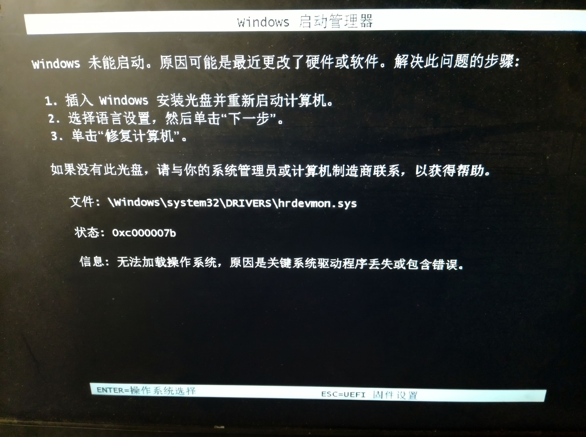
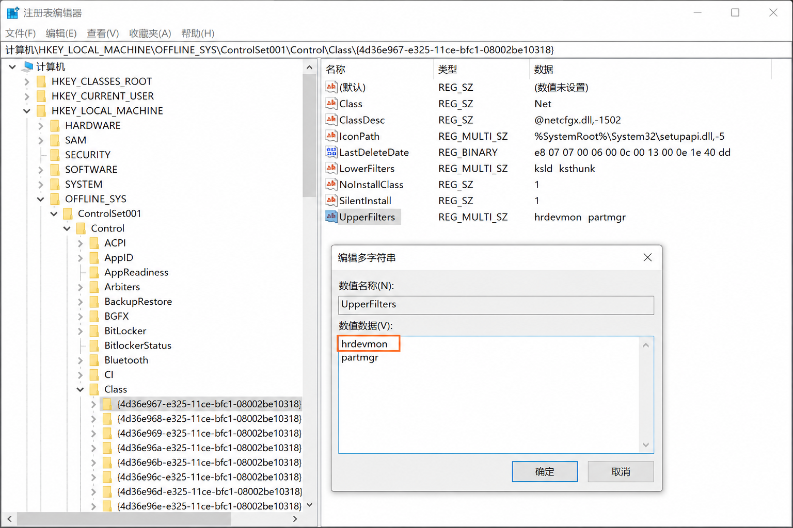
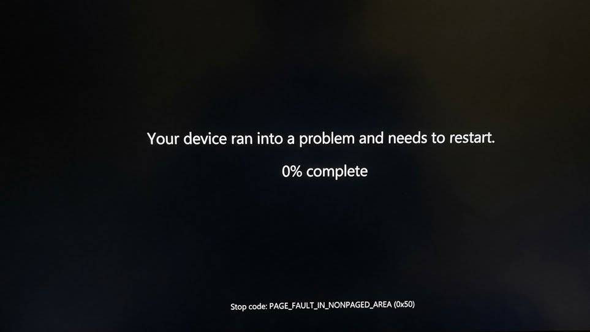

# 关于火绒安全软件hrdevmon.sys造成的无法开机的解决方案和.sys移植问题的探究

| 软件/系统名  | 本问题对应的版本号                           |
| :----------- | -------------------------------------------- |
| 操作系统     | Windows 11 IoT 企业版 LTSC（不忘初心精简版） |
| 操作系统版本 | 24H2(26100.8039)                             |
| 火绒安全软件 | 6.0.9.x                                      |
| 修补程序代号 | KB5085516（末次安装）                        |

## 发生了什么

2天前，为了跟进MathALL项目的开发迭代，打开电脑突然发现Windows启动管理器报错（详见下文），报错指示hrdevmon.sys存在问题，导致无法开机，后引发链式故障。
从毫无征兆的错误，到 `0x7B` 的引导丢失，再到跨机移植驱动引发的 `0x00000050` 内存越界，最后在 PE 环境下通过注册表微操和 BCD 命令行强行解决，这就是本次事件的全过程。
这篇文章，我将以偏技术的视角，完整复盘本次故障。

---

## 第一幕：蓝屏
如你所见，我的系统环境是 **Windows 11 24H2 精简版 (Lite)**，搭配了火绒安全软件（下称“火绒”）。问题当天（5月8日）早晨，电脑在正常运行，后发生过冷关机；当我晚上开机时，发现Windows启动管理器报错`0xc000007b`，问题文件是`hrdevmon.sys`图片如下。

遇到这种情况，我的第一反应是难办了。火绒部分驱动程序注册在 Ring 0（内核态）中，大概率是触发了签名异常或者驱动文件出现了写入时的错误。

于是，我进入了PE，想也没想地一口气删除了\Windows\system32\DRIVERS\hrdevmon.sys文件

> [!WARNING]
>
> 删除.sys这一步实际上是绝对禁止的低级错误，无论是否是第三方驱动程序，都应该评估和确定该驱动的关联驱动，再安全地删除注册表上的有关信息（若有），特别是驱动如果有极高的权限（如此驱动）和运行环境应该加`.bak`别名备份而非删除，这是非常危险的。切勿模仿。

结果是，造成了严重的启动问题，也就是提到的**0x7B错误**（Inaccessible_Boot_Device）。

## 针对.sys和0x7B错误科普

### 针对.sys的说明

Intel x86处理器特权级别分为4层，其中最高等级Ring 0(内核态)是系统核心进程存在位置，而普通软件运行在Ring 3(用户态)，用户态的一切权限受到管控，而内核态的进程**没有权限限制**，因为安全软件不仅运行在Ring 0，还会通过内核回调（如 `ObRegisterCallbacks`）注册自我保护机制，直接拦截并拒绝用户态（可能的病毒）发来的关闭指令，用户态的 .exe **根本够不到**它们，这也就是火绒要使用.sys以驱动程序和Ring 0内核态同级的原因。这样一来，就能够发现和及时制止危险操作。

普通的软件如果出现错误，那么大概率是这个软件可能会闪退、报错，严重一点也就是软件需要修复。

**但是**，如果内核驱动模块(.sys)出现故障，由于不存在环境隔离，**将直接导致蓝屏**（BSOD，不一定只有蓝色）。如果驱动在**早期启动阶段**就崩溃（Boot-Start Driver），系统甚至无法完成启动，会陷入：

```
开机 → 加载驱动 → 崩溃蓝屏 → 重启 → 再崩溃 → 无限循环
```

这便是为什么无法开机，是因为.sys内核驱动模块损坏了。

### 错误代码`0x7b`的产生原因

微软官方的文档对7B错误的产生原因解释中，有关本问题的有如下几条：

- Missing, corrupted, or misbehaving filter drivers that are related to the storage stack
- A faulty motherboard or storage controller, or faulty hardware

翻译：**与存储堆栈相关的缺失、损坏或行为不当的筛选器驱动程序**和**有故障的主板或存储控制器，或硬件故障**

初步分析这是驱动程序引发的，包含存储控制器在内的故障。

这就解释了为什么**删掉 hrdevmon.sys 会触发 0x7B**：

```
注册表中磁盘驱动器（Disk Drives） UpperFilter 列表还有 hrdevmon 的记录
       ↓
系统启动时尝试加载hrdevmon
       ↓
文件不存在，设备栈组建失败
       ↓
原下一个进程partmgr（分区管理驱动）无法进行
       ↓
分区找不到，磁盘不可访问 → 0x7B
```

至此，问题虽然明确了，但是解决是很麻烦的。

## 第二幕：闭眼开车

BSOD出现和报错是好事，因为找到了问题就可以修复了，但问题在于没有**显示错误文件**，一个冰冷的7B错误代码是解决不了问题的。

我无法确定是不是只有这一个文件造成了错误，情急之下，我只能通过PE前往注册表编辑器，通过加载配置单元的方式把HKEY_LOCAL_MACHINE\OFFLINE_SYS\ControlSet001\Control\Class\ {4d36e967-e325-11ce-bfc1-08002be10318}的右侧的UpperFilters第一行hrdevmon（如图橙色框内已标出）删除，仅保留partmgr。

删除以后，再次开机，问题尚未得到解决。

---

## 第三幕：移植
为了填补这个文件空缺，并且得到正确的文件。我从另一台正常运行的电脑上，把最新版火绒的 `.sys` 文件和相关注册表项完整拷贝并强行注入到这台崩溃的电脑中，并且把UpperFilters改回有火绒的样子。
**结果是惊人的：0x7B 被成功绕过，系统开始往后加载了！**
但就在我以为胜利在望、鼠标指示灯甚至都已经亮起时，屏幕再次黑屏重启，这次相当奇怪，根据经验判断，这次系统过了partmgr了，但是问题在于黑屏了3-5s才重启，且没有错误日志，这基本证明火绒出现了排异或者配置不对。

为了能得知到底发生了什么，由于这个系统没有WinRE，只好在PE通过修改 BCD 关闭自动重启（`bcdedit /set {default} recoveryenabled no`），终于得到了错误代码：
**0x00000050 (PAGE_FAULT_IN_NONPAGED_AREA)**

### 排异反应
火绒不是开源软件，根本无法获得其.sys的生成和写入逻辑。系统在第一阶段（挂载磁盘）被骗过了，但当它进入第二阶段，准备拉取外设和图形界面时出现严重问题，这值得好好思考。
每一台电脑的硬件环境、驱动内存分配池、以及内核对象的句柄在开机时都是动态且唯一的，而且我不知道火绒的版本是否匹配。移植的驱动按照它在A电脑上的习惯，去B电脑的内存里抓取资源。但是触发了空指针异常或者调用了精简版系统没有的API导致了内存越界访问错误。
这下确定了火绒的内核驱动模块不具备跨版本和跨设备的兼容性，意味着很难通过常规手段解决问题了。

---

## 第四幕：注册表抢修
到了这一步，别无选择，必须把火绒在系统底层埋下的所有隐患拆了。我开始在 PE 中挂载了故障机的 `SYSTEM` 配置单元，开始地毯式的斩草除根。
通过 `Ctrl+F` 配合硬件 GUID，清理了以下所有的 `UpperFilters`：

1. **Volume 存储卷 ({71a27cdd...})**：引发 0x7B 的核心。
2. **USB 控制器 ({36fc9e60...})**：U 盘防毒。这解释了为什么崩溃前键盘指示灯会亮——系统枚举 USB 总线时触发了外来驱动的崩溃。
3. **图像与多媒体 ({6bdd1fc6...}, {4d36e96c...}, {ca3e7ab9...})**：新老摄像头与麦克风防偷窥。
4. **便携设备 WPD ({eec5ad98...})**：移动设备防泄漏。
5. **硬盘驱动器({4d36e967-e325-11ce-bfc1-08002be10318})**：最重要的一项。

- 删除 `ControlSet001\Services` 下的 `sysdiag` 等独立服务文件夹。
- ~~清理 `Services\FltMgr\Instances` 中向微软原生的文件系统微过滤管理器注册的实例**（不存在）**~~

---

## 第五幕：结束
在 PE 的命令行中，重新挂载了 UEFI 的 ESP 分区，并解除一切额外的模式：

```dos
# 重新挂载 EFI 分区
diskpart
select volume 3
assign letter=S
exit

# 擦除安全模式强制指令，恢复正常引导
bcdedit /store S:\EFI\Microsoft\Boot\BCD /deletevalue {default} safeboot

```

当熟悉的 Windows 锁屏界面伴随着光标出现时，我迫不及待立刻卸载了火绒，这场持续了几个小时的内核战争，终于宣告胜利。

---

## 究竟发生了什么
事后复盘，这次事件给了我极大的震撼，也再次验证了真理：

### 问题猜测

初步猜测，这次的问题产生是因为火绒在更新软件时，和电脑中某些软件或硬件的**驱动程序相冲突**，或者因为**出于某些必要设计的新API在精简版系统上出现了空指针异常**，由于火绒软件不开源，我也不想花更多时间复现和调试，有兴趣的可以自行复现。

我这次处理问题相当复杂，验证了排异反应，且做了一些无用功。按道理来说，**只要一开始猜测火绒的内核驱动模块损坏，就行该直接去注册表把有关火绒的内核驱动模块绑定全部解除，这是解决本问题的最快方式**，但是尽管走了很多弯路，也学会了很多新技能，未尝不是好事。

### 给开发商/自己后续开发的建议

1. 不要给用户留坑。如果放弃修复，那么必然是重装系统，在这种情况下，几乎**不可能使用官方工具覆盖安装**，只能手动备份重装，这对用户是很大的时间浪费和考验，而一般的人我觉得不会搞这出麻烦的修复。
2. 更新软件前应该做适配性检查，对更新的内容进行调试测试，**不能推送的更新不应强行推送**。
3. 征求用户的更新意见，不在危险的时段更新，**做好意外断电防护措施**。

### 深刻的启发

1. **永远不要在重要环境运行“精简版”系统搭配“侵入式”底层软件。** 它们之间的反应是不可预知的。
2. **面对底层依赖断裂，避免“微操”。** 后来回想，其实我只需要在第一次进 PE 时，用几分钟把注册表里的 `UpperFilters` 引用删掉，系统当场就能复活。而我却试图移植外来驱动，徒增了巨大的排错成本。
3. **做隔离、快照。** 未来我会将更核心的开发工作流向 WSL2、Docker 或虚拟机中迁移；同时，一定要保持开启 Windows 的 VSS 卷影拷贝服务。**不要抱有任何侥幸心理**。当底层注册表被污染到无法挽回时，**一个 1 分钟的快照回滚，胜过无数个熬夜修复的夜晚。**
4. 困难是常态，回避是懦弱，直面才是胜利。技术上该说的也就上面这些，不过说真的，**最开始**遇到这链式的报错我想**重装系统**，我知道这类问题一旦陷进去很难解决，可能越解决问题越多越复杂。哪怕手动备份重装，最多3小时结束，而修复这个问题，我**花了4个半小时**。这4个半小时遇到的困难相比3小时安静度过，可以说是自讨苦吃。但是网上根本没有关于这个问题的解法，所有人都说要重装系统解决，越是没有有关这类问题的解法，越应开创先河，即使不能解决问题，这种坚持不懈的精神是重装系统给不了的。我没有也不可能解决火绒的问题，但是我得到了解决用户侧的这类内核驱动模块损坏的问题最简单的方法，得到的结论和过程让我难以忘怀。这才是面对困难的真正方式，不是在困境中退缩寻找平凡的舒适感，而是**应迎难而上以勇气剖开一切，得到最终的回响**。

末次更新：2026-5-10 17:58:33