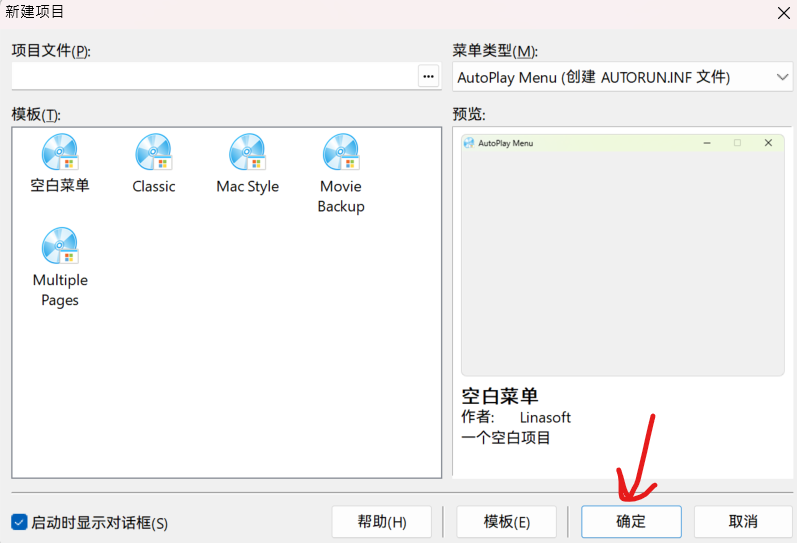

:::caution[过时注意]
本文的发布距今过了很长时间，请注意有些内容在当今能否使用。
:::

## 开篇点题

每逢暑假都有做软件的困扰，尤其是安装程序一多，再写不清操作文本，就。。。。。

于是，**AutoPlay Menu Builder**的降临就打破了历史性的做法，通过图形化的GUI来做安装程序的GUI以让用户用GUI安装程序(逆天语言)

该软件不同寻常的是，具有极大的开放性，可以随意地修改参数，做出个性化的安装菜单。

本教程中需要：

- 一个聪明的大脑、一双勤劳的双手
- 一台Windows计算机(Win 8.1以上)

## 安装

只需要按照安装程序一路走y。

## 使用

(图片在同步时进行了重置)

## 注意事项

生成时，请注意生成目录否则很危险。(指你的文件)

## 何处下载
(2026年1月30日对文件做了更新)
https://wwbdo.lanzoue.com/iQfWd3hdvkdi
密码bu3q